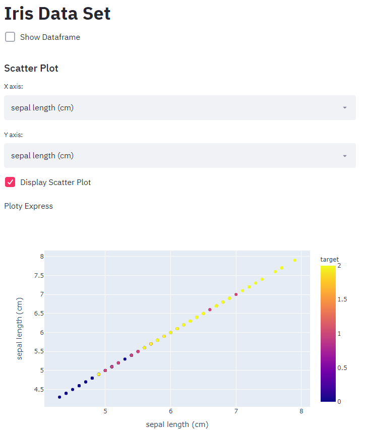
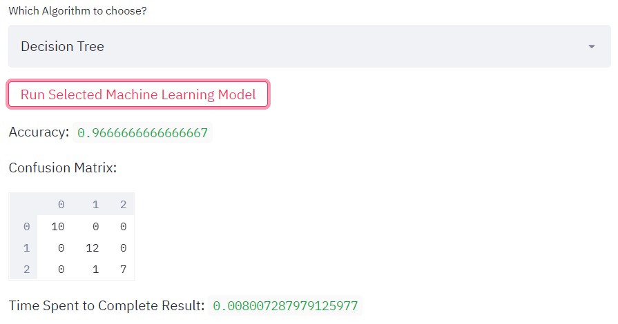
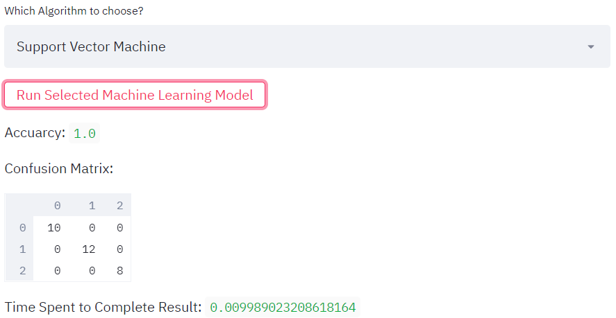

# iris_streamlit_app
This is a project that introduces how to deploy machine learning using streamlit

This is a walk-through project that I followed on the internet.
Here is the project reference:

 https://datasciencechalktalk.com/2019/10/22/building-machine-learning-apps-with-streamlit/
 
Although I made some edits to the body code, the idea behind my app is fully depending on the auother "valentinaalto's" procedure 
in creating the Machine Learning app. She/He has motivated me to explore more on the use of streamlit. 

General Overview of the App

Here are the example results

